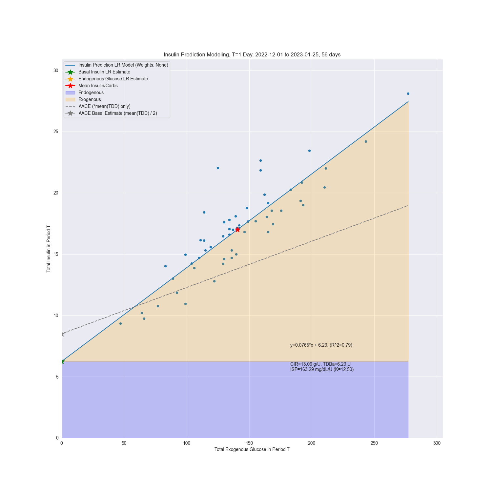

# InsuLearner: Estimating Insulin Pump Settings with Machine Learning
## Author: Cameron Summers
#### Author's Website: [www.CameronSummers.com](https://www.CameronSummers.com)

---

### Overview:

This is the code underlying [my article](https://www.CameronSummers.com/how_I_calculate_my_sons_insulin_pump_settings_with_machine_learning) 
where I describe in plain language the machine learning approach I developed to compute 
the insulin pump settings for my son.

This library estimates personalized insulin pump settings from historical insulin
and carbohydrate information. Currently, it interfaces with [Tidepool](https://www.tidepool.org)
accounts to retrieve data.

The code uses machine learning to estimate:

- Carbohydate Ratio (CIR)
- Basal Rate
- Insulin Sensivity Factor (ISF)

Historical carbohydrate and insulin data directly estimate CIR and Basal 
Rate using Linear Regression. An estimate of Carbohydrate Sensitivity Factor 
(CSF) and the estimate CIR is used to estimate ISF.

Here is an example plot of a fitted model and estimated settings:



## Dependencies

Developed and tested with Python 3.9

## Installation

```
pip install insulearner
cd InsuLearner
```

## Usage

There is a command line interface in `insulearner.py`

### Examples

If you don't know your Carbohydrate Sensitivity Factor (CSF) I devised
an estimator based on height and weight. Note: this estimator is an
educated guess and *not validated*. It's probably better if you estimate
it yourself.

`python insulearner.py <your_tidepool_email> <your_tidepool_password> --num_days 60 --height_inches 72 --weight_lbs 200 --gender male`

If you do have an estimate of your CSF:

`python insulearner.py <your_tidepool_email> <your_tidepool_password> --num_days 60 --CSF 4.2`

### Options

`--agg_period_window_size_hours` This is the size of the time period in days over which
aggregate insulin and carb data. I theorized in [my article](https://www.cameronsummers.com/how_I_calculate_my_sons_insulin_pump_settings_with_machine_learning) 
that longer periods would converge to better estimates of CIR and Basal Rate. Default
is 1 day (24 hours) but I have seen good results with many more days.

`--agg_period_hop_size_hours` This is how much to shift over the aggregation
window for each data point. For example, if the window size above is 72 hrs 
and this is 24 hours, then the aggregation for the first data point will be days 1-3, the
second data point will be days 2-4, and the third data point will
be days 3-5, and so on.

`--estimate_agg_boundaries` If set this will use an autocorrelation-like algorithm to
estimate the hour of the day when blood glucose movement is the least active, ie 
isolating associated insulin and carb effects.


## Algorithms

There are three algorithms I created that are in this code and worth
being aware of.

1. An autocorrelation-like algorithm to find inactive periods in data
    in order to help denoise the data for fitting a model.
2. Linear Regression to estimate Carb Ratio (CIR), Basal Rate, and Insulin
    Sensitivity Factor (ISF)
   1. This is methodology is described in [my article](https://www.CameronSummers.com/how_I_calculate_my_sons_insulin_pump_settings_with_machine_learning).
3. Estimating Carb Sensitivity Factor (CSF)
   1. CSF is used to derive ISF from the estimated CIR from the Linear Regression. 
        It's best to estimate CSF through testing, but I've provided an
        algorithm to approximate it based on blood volume computed via height
        and weight. While based on knowledge of biology this algorithm *has not been validated*. 


## Acknowledgements

Special thanks to [Tidepool](https://www.tidepool.org) for doing
great things for the diabetes community.

## How to Contribute

### Contribute Code:

Hello! Thanks for considering contributing.

- Step 1. Please open an Issue with a description of what you're trying to add/fix/change
- Step 2. Fork and create a feature branch in the format <some-description>/<your issue number>
- Step 3. Please squash all your commits into one with a good commit message before opening a pull request
- Step 4. Open a pull request, reference your original issue, and provide a concise description of how your changes fixed the issue
- Step 5. Your PR requires approval before it can be merged.

### Contribute Results:

If you've run this and had success or issues, please consider sharing so 
it can be improved. You can message me on [my website](https://www.cameronsummers.com/contact).


## License: [GPLv3](https://www.gnu.org/licenses/gpl-3.0.en.html)


